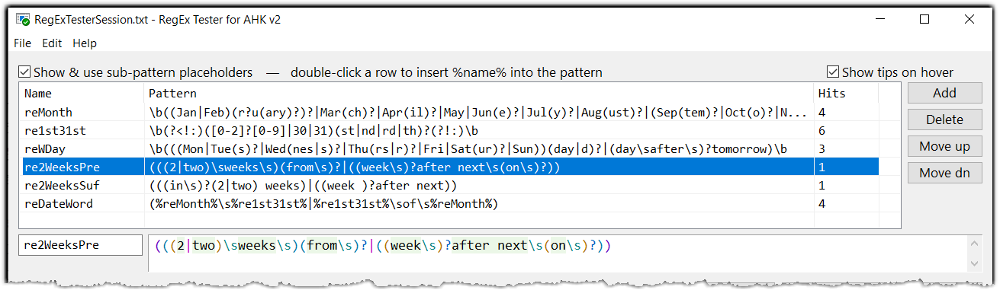
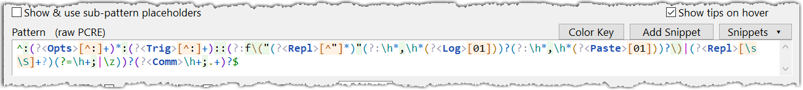
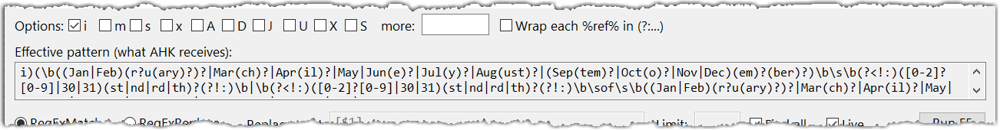
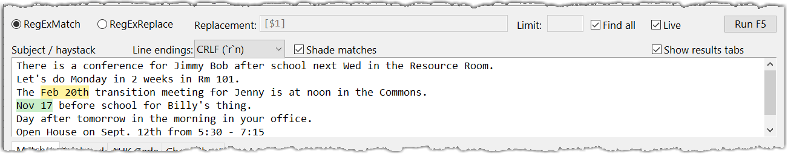
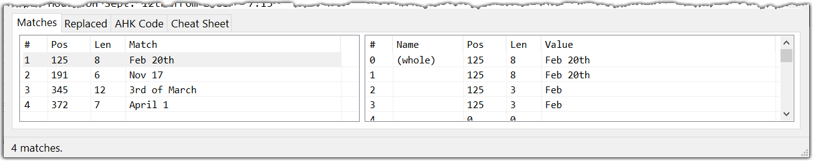
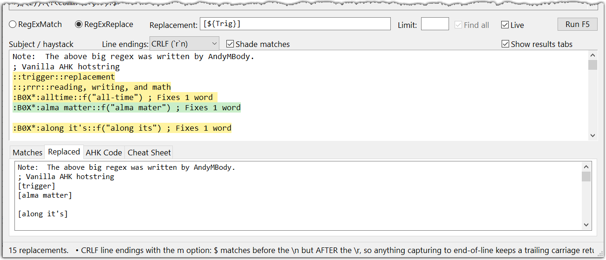
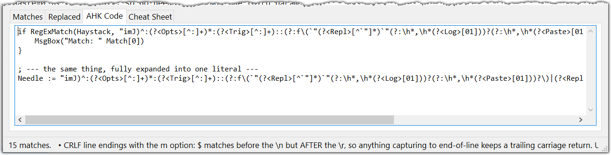
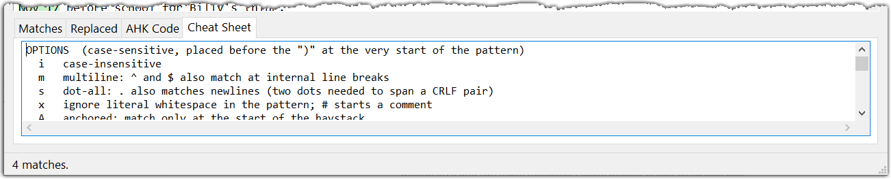

# RegEx Tester for AHK v2 — User Manual

- **Version:** (App version date will be in code.  User Manual date: Aug 3, 2026)
- **Author:** kunkel321 (with Claude)
- **Repo:** https://github.com/kunkel321/RegExTester
- **Forum thread:** https://www.autohotkey.com/boards/viewtopic.php?f=83&t=140951

---

## Contents

- [RegEx Tester for AHK v2 — User Manual](#regex-tester-for-ahk-v2--user-manual)
  - [Contents](#contents)
  - [1. What it is](#1-what-it-is)
  - [2. Installing and running](#2-installing-and-running)
    - [Requirements](#requirements)
    - [Folder layout](#folder-layout)
    - [About that .exe](#about-that-exe)
    - [First run](#first-run)
  - [3. Quick start](#3-quick-start)
  - [4. The window, area by area](#4-the-window-area-by-area)
    - [4.1 Placeholder table (top)](#41-placeholder-table-top)
    - [4.2 Pattern box](#42-pattern-box)
    - [4.3 Options row](#43-options-row)
    - [4.4 Effective pattern](#44-effective-pattern)
    - [4.5 Mode row](#45-mode-row)
    - [4.6 Subject / haystack](#46-subject--haystack)
    - [4.7 Results tabs](#47-results-tabs)
    - [4.8 Status bar](#48-status-bar)
  - [5. Menus](#5-menus)
    - [File](#file)
    - [Edit](#edit)
    - [Help](#help)
  - [6. Keyboard and mouse reference](#6-keyboard-and-mouse-reference)
  - [7. Warnings in the status bar](#7-warnings-in-the-status-bar)
  - [8. Pattern box colors](#8-pattern-box-colors)
  - [9. The session file](#9-the-session-file)
  - [10. Things that will bite you](#10-things-that-will-bite-you)
  - [11. Tunables](#11-tunables)
  - [12. Credits](#12-credits)

---

## 1. What it is

A live regular-expression tester that runs on **AutoHotkey's own PCRE engine**. Not a
re-implementation, not a lookalike — the tester calls `RegExMatch()` and `RegExReplace()`
directly, so what you see in the window is exactly what a script will do with the same
pattern. Option letters, `$` behavior at line ends, backreference syntax in the
replacement string: all of it matches AHK because it *is* AHK.

The distinguishing feature is **placeholders**: named sub-patterns defined once in a
table and then pulled into the main pattern (or into each other) as `%name%`. That
mirrors the way real scripts build patterns by concatenating variables:

```autohotkey
reMonth   := "\b((Jan|Feb)(r?u(ary)?)?|Mar(ch)?|...)\b"
re1st31st := "\b(?<!:)([0-2]?[0-9]|30|31)(st|nd|rd|th)?(?!:)\b"
RegExMatch(txt, "i)(" reMonth "\s" re1st31st ")", &myDate)
```

...which in the tester is just:

```
(%reMonth%\s%re1st31st%)
```

The **AHK Code** tab regenerates the concatenated form above, ready to paste into a
script. **File ▸ Import from AHK code** goes the other direction. No online regex tester
does this, which is why this one exists.

The placeholder system can be switched off entirely (untick *Show & use sub-pattern
placeholders*), at which point the tool behaves like an ordinary regex tester and `%name%`
is matched as literal text.

---

## 2. Installing and running

### Requirements

- Windows (developed on Win 10, dual monitor, 125% DPI)
- AutoHotkey **v2.0** or later
- `Tools\RichEdit.ahk` by *just me* — https://github.com/AHK-just-me/AHK2_RichEdit

The RichEdit library is the only `#Include`. It supplies the three rich edit controls
(haystack, main pattern, placeholder pattern), which is what makes in-place match shading
and syntax coloring possible. Two other libraries — Mesut Akcan's `CtrlToolTip` and the
companion `LVHeaderToolTips` — are **embedded** in the script rather than included, so
that `RegExTester.ahk` stays a single portable file.

### Folder layout

```
RegExTester\
    RegExTester.exe            <- a RENAMED COPY of AutoHotkey64.exe
    RegExTester.ahk
    RegExTesterSession.txt     <- created on first exit
    Tools\
        RichEdit.ahk
```

### About that .exe

The GitHub repo ships **a renamed copy of the 64-bit AutoHotkey interpreter, not a
compiled executable.** `RegExTester.exe` is byte-for-byte `AutoHotkey64.exe` with a
different filename. AutoHotkey looks for a `.ahk` file whose name matches its own, finds
`RegExTester.ahk` sitting beside it, and runs it.

Consequences worth knowing:

- **The script stays readable and editable.** Change a color in the TUNABLES block, save,
  restart. Nothing to recompile.
- **It's portable.** Drop the folder on a flash drive; no install, no registry, and no
  need for AutoHotkey to be installed on the machine at all.
- **Antivirus behaves better** than it does with compiled AHK scripts, which are a
  perennial false-positive magnet.
- If you'd rather run it the ordinary way, delete the `.exe` and just double-click
  `RegExTester.ahk` with AutoHotkey v2 installed. Everything works identically.

The tray icon is a window with a green checkmark (`imageres.dll`, icon 20), chosen so this
script is distinguishable from the other AHK tools in the tray. Hovering the tray icon
names the app and the loaded session file.

### First run

There's no session file yet, so the tester loads the **Date phrases** demo — the
OutlookMagnet placeholder set — and you land in a window that already has something to
look at. On exit it writes `RegExTesterSession.txt` beside the script, and from then on it
reopens exactly where you left off, right down to the window size.

---

## 3. Quick start

**Testing an ordinary pattern.** Untick *Show & use sub-pattern placeholders* to fold the
table away. Type or paste a pattern into the **Pattern** box, paste some text into
**Subject / haystack**, and read the results. Matching runs automatically about a third of
a second after you stop typing.

**Testing a composed pattern.** Leave placeholders on. Press **Add** to create a row, name
it, put a pattern fragment in the box below the table. Repeat. Then in the main Pattern
box, write `%name%` wherever that fragment belongs — or just double-click a row to drop
its token in at the caret. The **Hits** column tells you how many times each fragment
matches the haystack *by itself*, which is how you find the one piece that isn't firing.

**Getting it into a script.** Open the **AHK Code** tab and copy. Or use **Edit ▸ Copy
pattern as AHK literal** for just the pattern, correctly escaped for a double-quoted
string.

---

## 4. The window, area by area

### 4.1 Placeholder table (top)



**☑ Show & use sub-pattern placeholders** — the checkbox doubles as the section label.
Untick it and the table folds away *and the feature turns off*: `%name%` then matches as
literal text, and the generated code stops declaring variables. Your definitions are kept
either way — tick it again and they come back.

| Column | Meaning |
|---|---|
| **Name** | The placeholder's name. Letters, digits, underscore, not starting with a digit — the same rule as an AHK variable, because that is exactly what it becomes on the AHK Code tab. |
| **Pattern** | The raw PCRE fragment, flattened to one line for display (¶ is a line break, → a tab). Edit the real text in the box below the list. |
| **Hits** | How many times this fragment alone matches the haystack, with the current options applied. |

**Reading the Hits column.** A `∅` after the number means the sub-pattern can match an
empty string — which is usually the explanation for a count that looks impossibly large.
`err` means the fragment does not compile on its own. A `-` means the haystack is over
200,000 characters and the per-placeholder counting was skipped as too expensive. Counting
stops at 2,000 hits per fragment.

**Buttons.** *Add* creates an empty row and puts the caret in the Name box. *Delete*
removes the selected row — any `%name%` still referring to it turns red in the pattern box,
since it no longer resolves. *Move up* / *Move dn* reorder the list, but order is purely
cosmetic: it changes neither matching nor the generated code, which is sorted by
dependency.

**The two edit boxes below the table** hold the selected row's name and pattern. The
pattern box is itself a rich edit with the full syntax coloring, because a fragment is
exactly where a missed paren hides.

A placeholder may reference other placeholders as `%name%`. Circular references are
detected and reported rather than hanging.

**☑ Show tips on hover** (top right) puts an explanatory tooltip on every control and on
every ListView column header. Some of that text overlaps the Cheat Sheet tab on purpose —
the tip is for the control you are looking at, the tab is for browsing. The setting is
remembered in the session file.

### 4.2 Pattern box



Holds the **RAW pattern** — what PCRE sees, *not* an AHK string literal. Type `\t` or a
real tab, not `` `t ``. Type `\n`, not `` `n ``. (The tester warns you if you forget; see
§7.)

Options do **not** go in the pattern. They go in the checkboxes below. The tester always
emits an explicit `opts)` prefix, so a pattern that legitimately starts with `)` or with
option letters still behaves correctly.

Syntax coloring is live, grouped by *meaning* rather than by character — see §8. Put the
caret next to a `(` or `)` and its partner lights up in blue.

Three buttons sit on the label row:

- **Color Key** — opens a legend for the pattern box: every coloring rule, shown in the
  color it actually produces, next to a sample that produces it. The samples are run
  through the same tokenizer that colors the pattern box, so the legend cannot fall out of
  date.
- **Add Snippet** — banks the current pattern. Nothing is ever recorded automatically; a
  pattern is remembered only when you press this, which is what keeps the list worth
  reading.
- **Snippets ▾** — recall, remove, or clear a banked pattern. The last 25 are kept, newest
  first, and they're saved with the session. Re-adding a pattern already in the list
  promotes it to the top rather than duplicating it. The menu also offers *Remove the entry
  I pick next* and *Clear all snippets*.

The pattern you are currently working on is saved with the session quite separately, so it
survives a restart whether or not you ever bank it.

### 4.3 Options row

Ten checkboxes, in the canonical order they get emitted:

| | Meaning |
|---|---|
| **i** | Case-insensitive. |
| **m** | Multiline: `^` and `$` also match at internal line breaks, not only at the two ends of the haystack. |
| **s** | Dot-all: `.` also matches a newline. With CRLF line endings a break is *two* characters, so it takes two dots to cross one. |
| **x** | Extended: literal whitespace in the pattern is ignored and `#` starts a comment. Use `\s`, `\x20` or a character class when you actually mean a space. |
| **A** | Anchored: match only at the start of the haystack. This is the right way to anchor at a start position — a leading `^` still refers to the true start of the string. |
| **D** | Dollar-endonly: `$` matches only at the very end, even when the haystack ends in a newline. Ignored when `m` is also on. |
| **J** | Allow two capture groups to share one name. |
| **U** | Ungreedy: quantifiers become lazy by default, and a following `?` makes them greedy again — the reverse of the usual meaning. |
| **X** | PCRE_EXTRA: a backslash followed by a letter that has no meaning throws an error instead of being taken as the letter. |
| **S** | Study the pattern. A small speedup when the same pattern is run many times; it cannot change what matches. |

**more:** — anything typed in this box is appended to the letters ticked above. Use it for
`C` (auto-callout), for the newline-marker options, or for a leading `(*VERB)` that has to
reach the engine verbatim.

**☐ Wrap each %ref% in (?:...)** — wraps every `%name%` expansion in a non-capturing group
before the pattern is run. **Off by default**, because plain concatenation is what a real
script does, and showing you when that bites is half the point of this tester. Tick it to
confirm that a stray top-level `|` inside a placeholder is the reason a pattern is matching
too much. The AHK Code tab emits the wrap too, so pasted code behaves the same way it did
here.

### 4.4 Effective pattern



*The pattern above is just `%reDateWord%`, which pulls in `%reMonth%` and `%re1st31st%`
between them. This is what the engine actually receives.*

Read-only. The pattern after every `%name%` has been expanded and the option prefix
prepended — literally the string handed to `RegExMatch()`. **It turns pink when that string
will not compile**, and the status bar carries the engine's complaint.

### 4.5 Mode row

**◉ RegExMatch** — list every match with its capture groups.
**◉ RegExReplace** — show the result on the Replaced tab. The match and group lists are
*still* filled in, so you can see exactly what each replacement acted on. Switching to this
mode auto-selects the Replaced tab.

**Replacement:** (replace mode only) — `$1 $2 ...` for capture groups, `${name}` for a
named one, `$0` for the whole match, `$$` for a literal dollar sign. `$U1` / `$L1` upper-
or lower-case that group. Note that `\1` is *not* a backreference here — AHK follows PCRE
and wants `$1`. The tester warns if it sees `\1`.

**Limit:** (replace mode only) — maximum number of replacements. Blank means replace every
match.

**☑ Find all** (match mode only) — ticked, find every match; unticked, stop after the
first, which is what a bare `RegExMatch()` call does in a script.

**☑ Live** — re-run automatically ~300 ms after you stop typing. **Untick it before trying
a pattern that might backtrack catastrophically.** A runaway pattern hangs this window
exactly as it would hang a real script; the engine is the same one.

**Run F5** — run once, now.

### 4.6 Subject / haystack



Type or paste anything; it's saved with the session.

**Line endings:** `CRLF` / `LF` / `CR`. Not cosmetic. The edit control itself stores one CR
per break; this setting decides whether the *engine* is handed CRLF, LF, or CR, which
changes what `$`, `.` and `\n` can match. Match positions are adjusted to compensate, so
the shading still lands in the right place either way.

**☑ Shade matches** — tints each match in place, alternating amber and green so that two
matches which touch stay distinguishable. Shading stops after 400 matches. (See §10 for
the undo-stack consequence.)

**☑ Show results tabs** — folds the results tabs away and hands their share of the window
to the haystack, which is useful while you're still pasting text in. The haystack and the
tabs normally split the flexible height evenly, so hiding the tabs roughly doubles the room
for your text. Matching still runs while they're hidden; the Matches list simply isn't on
screen. Saved with the session.

### 4.7 Results tabs

**Matches** — two lists side by side.



*Left (matches):* `#`, `Pos`, `Len`, `Match`. Pos is the 1-based character position, the
same number `RegExMatch()` reports as `Match.Pos`. A `Len` of zero means the pattern matched
an empty string here, which also means it matches between every pair of characters — almost
never intended. **Click a row to select that match in the haystack.**

*Right (capture groups):* `#`, `Name`, `Pos`, `Len`, `Value`. Row 0 is the whole match. Name
is filled in for `(?<name>...)` groups and blank for numbered ones. A `Pos` of **zero** means
the group did *not take part* in this match — a different thing from matching an empty
string. **Click a row to select just that group in the haystack.**

Both lists flatten text to one line for display: ¶ is a line break, → is a tab.

Group 4 in the screenshot above shows `Pos 0`, `Len 0` — that branch of the alternation
never ran, so the group captured nothing at all.

**Replaced** — the result string from `RegExReplace()`.



*Replace mode on the AutoCorrect2 hotstring demo, pulling out named group `Trig` with
`[${Trig}]`. Note that* Find all *is grayed out — it doesn't apply here — and that the
status bar is carrying a warning alongside the replacement count.*

**AHK Code** — the regenerated concatenated-variable form: each placeholder as a `name :=`
assignment (sorted dependency-first, so it pastes and runs), then the `RegExMatch()` or
`RegExReplace()` call, then the same pattern a second time fully expanded into a single
literal. Copy it with **Edit ▸ Copy generated AHK code**.



*The three placeholders come out as `:=` assignments in dependency order — `reMonth` and
`re1st31st` before `reDateWord`, which references them — followed by the call itself.
Paste and run.*

**Cheat Sheet** — a scrollable reference covering options, character classes, quantifiers,
anchors, groups, lookaround, the match object, replacement syntax, the two concatenation
traps, the placeholder system, the color scheme, and snippets.



### 4.8 Status bar

Result count and warnings, joined onto one line. The bar is narrow and truncates, so
**hover it** to see the full message with every warning on its own line. Errors are prefixed
`ERROR:`.

---

## 5. Menus

### File

| Item | |
|---|---|
| **Save session** `Ctrl+S` | Write the session file now. |
| **Save session as...** | Write to a new path — and *adopt* it, so `Ctrl+S` and the save-on-exit go to the new file from then on. |
| **Open session...** | Load a session file and adopt it. |
| **Import from AHK code...** | See below. |
| **Load demo ▸ Date phrases, built from placeholders (OutlookMagnet)** | The placeholder-heavy demo. |
| **Load demo ▸ Hotstring parser, one big pattern (AutoCorrect2)** | AndyMBody's hotstring parser — one large self-contained pattern of the sort any other regex tester would take. |
| **Clear everything** | Wipes placeholders, pattern, and haystack, after a confirmation. |
| **Exit** | Saves the session, then quits. |

**Import from AHK code** opens a paste box. Every `name := "pattern"` assignment becomes a
placeholder, and the first `RegExMatch()`/`RegExReplace()` call supplies the main pattern
and its options. Variable references on the right-hand side are written back as `%name%`,
so a concatenated expression round-trips into the placeholder form. Right-hand sides that
are function calls are skipped. A `Replace existing placeholders` checkbox decides whether
the import clears the table first or merges into it. Importing a `RegExReplace()` call also
switches the mode and fills in the replacement string.

### Edit

- **Copy effective pattern** — the fully expanded string with its option prefix.
- **Copy pattern as AHK literal** — the same thing wrapped in quotes and escaped for an
  AHK v2 double-quoted string.
- **Copy generated AHK code** — the whole AHK Code tab.
- **Pull option prefix out of pattern** — if you pasted a pattern that begins `i)` or
  `ims)`, this strips the prefix and ticks the matching checkboxes instead.

### Help

Three web links: the RegEx quick reference, the `RegExMatch` docs, and the `RegExReplace`
docs on autohotkey.com.

---

## 6. Keyboard and mouse reference

| | |
|---|---|
| `F5` | Run once |
| `Ctrl+S` | Save session |
| Double-click a placeholder row | Insert `%name%` into the pattern at the caret |
| Click a match row | Select that match in the haystack |
| Click a capture-group row | Select just that group in the haystack |
| Caret beside a `(` or `)` in the pattern | Highlights the matching paren |
| Hover any control or column header | Explanatory tip (when *Show tips on hover* is ticked) |
| Hover the status bar | Full warning text, one per line |

Both hotkeys are context-limited to the tester's own window, so they don't leak into other
applications.

---

## 7. Warnings in the status bar

These are cheap static checks for the traps that bite people repeatedly. The design rule
is that a check which cries wolf on legitimate patterns is worse than no check, so anything
speculative is worded as a heads-up rather than an accusation.

| Warning | What it means |
|---|---|
| **Undefined placeholder(s) left literal** | You wrote `%name%` for a placeholder that doesn't exist. It matched as literal text. |
| **Pattern starts with an option prefix** | You pasted `i)...` into the box. Use *Edit ▸ Pull option prefix*. |
| **Pattern contains a backtick escape** | You typed `` `n `` or `` `t ``. This box holds the raw pattern, not an AHK string literal — write `\n`, `\t`, `\r`. This is the single most common mix-up for AHK users. |
| **Pattern begins or ends with a space or tab** | Usually a paste artifact. It matches literally. (Suppressed when `x` is on.) |
| **A top-level `\|` with `^` or `$`** | `\|` has the lowest precedence of anything in regex, so `^cat\|dog$` means `(^cat)` or `(dog$)`, not `^(cat\|dog)$`. Wrap the alternation in `(?:...)`. |
| **CRLF line endings with the m option** | `$` matches before the `\n` but *after* the `\r`, so anything capturing to end-of-line keeps a trailing carriage return. Use `\r?$` or switch line endings to LF. |
| **A quantified group whose body is also quantified** | e.g. `(\w+)+`. On text that *almost* matches, this can backtrack catastrophically and hang the window. Deliberately a heads-up: the cheap test can't tell `(\w+)+` from the harmless `(ab?c)+`. |
| **`%name%` has a top-level `\|`** | Spliced into a bigger pattern, it splits the *whole* pattern, so groups in the other branches never capture. Tick *Wrap each %ref%* or put `(?:...)` around it. |
| **Replacement uses `\1`** | AHK follows PCRE and wants `$1`. A backslash-digit is passed through as literal text. |
| **Placeholder support is off** | You wrote `%name%` with the feature disabled, so it matched literally. |
| **The haystack is empty** | Nothing to match against. |
| **N of them are ZERO-LENGTH** | The pattern can match an empty string, so it also matches between characters. Look for a `?` or `*` that makes every branch optional. |

---

## 8. Pattern box colors

The palette is grouped by **meaning** rather than by character, so things that behave alike
look alike.

| Color | Means |
|---|---|
| **Green** | Asserts a position and consumes nothing — `^ $ \b \A \z`, and the `?= ?! ?<= ?<!` of a lookaround |
| **Teal** | Matches a character — `\d \w \s \h \p{L}` |
| **Lighter teal** | One specific code point — `\x41 \x{263A} \cA \t` |
| **Brown** | A metacharacter made ordinary — `\. \( \\` |
| **Blue** | Repetition — `* + ? {2,5}`; a paler blue for the `?`/`+` that makes one lazy or possessive |
| **Bright blue** | Backreference — `\1 \k<name> (?P=name) (?&name)` |
| **Orange** | The `[ ^ ]` of a character class, with a pale tint across the whole class so it reads as one unit while its contents keep their own colors; a stronger orange for the `-` in `[a-z]` |
| **Purple** | POSIX class — `[:alpha:]` and friends |
| **Magenta** | `\|` |
| **Olive** | `.` |
| **Purple / blue / amber, cycling** | Group nesting depth |
| **Gray** | Punctuation that only holds a construct together — the `?:` `?>` plumbing, and comments |
| **Blue-on-white name** | The name in `(?<name>...)` |
| **Blue on pale blue** | A `%known%` placeholder |
| **Dark red on pink** | An `%unknown%` placeholder |
| **Pale green background** | Text the pattern matches literally, with adjacent characters coalesced so words stay readable. It's a background rather than a foreground because black is the most readable ink there is, and the job here is to *group* the words, not recolor them. |
| **Light gray background** | With `x` on: whitespace the engine discards |
| **Light blue background** | The `(` `)` pair on either side of the caret |
| **White on red** | **Will not compile.** Red always means broken, never merely unusual. |

Notably **not** red: a lone `]`, a lone `}`, and a `{` that isn't a quantifier. PCRE demotes
all three to ordinary literal characters, so they get the muted "literal" gray — *you typed
a metacharacter, but here it's only a character* — which is the honest answer. Calling them
errors would condemn patterns that work fine.

Press **Color Key** for the live legend.

---

## 9. The session file

`RegExTesterSession.txt`, written beside the script on exit and on `Ctrl+S`. Plain UTF-8
text with one `KEY=value` per line.

It is **not** an INI file, deliberately: patterns can end in whitespace and can contain
`=`, and the Windows INI API trims. Instead, values are escaped — `&` → `&a;`, CR → `&r;`,
LF → `&n;`, tab → `&t;` — which survives round-tripping intact.

What's stored: option letters, mode, Find all / Live / Shade / Wrap / Tips / placeholders-on
/ tabs-on, line-ending choice, replacement limit, window width and height, every
placeholder (`PH=name<tab>pattern`), the main pattern, the replacement string, the haystack,
and every banked snippet (`HIST=`, kept under the old key name for backward compatibility).

The window size stored is the **client** size, and only captured while the window is not
maximized — saving a maximized size would reopen a window that fills the screen but isn't
actually maximized, which reads as a bug. Hand-edited sizes are clamped to a floor of
820×620 and a ceiling of the *virtual* screen size, so a two-monitor layout still works.

The title bar shows the session file name first, Windows convention, so it stays legible
when the taskbar truncates:

```
RegExTesterSession.txt - RegEx Tester for AHK v2
```

Just the base name while the file sits beside the script; the full path once it doesn't,
since that's exactly when two sessions can share a name.

You can keep several sessions — one per project — with *Save session as* and *Open session*.

---

## 10. Things that will bite you

**The Pattern box is raw PCRE, not an AHK string literal.** Write `\t`, not `` `t ``. This
trips up every AHK user at least once; there's a warning for it.

**A pathological pattern will hang the window** exactly as it would hang a real script.
The engine is the same one. Untick **Live** before trying anything with nested quantifiers.

**Ctrl+Z in the haystack takes several presses.** Shading pushes entries onto the rich
edit's undo stack, so undo has to walk back through the formatting operations before it
reaches your typing. Untick *Shade matches* if you're doing heavy editing in that pane.

**Options belong in the checkboxes.** Typing `i)` at the front of the pattern works by
accident but breaks the effective-pattern display and the code generation. Use *Edit ▸ Pull
option prefix* to fix a pasted one.

**Placeholder Hits are expensive.** Each one compiles and runs separately against the whole
haystack. Over 200,000 characters the column is skipped and shows `-`.

**Caps.** Shading stops at 400 matches, the find-all loop stops at 5,000, per-placeholder
hit counting stops at 2,000, and 25 snippets are kept.

**Group Pos = 0 is not the same as Len = 0.** Zero position means the group didn't
participate in the match at all; an optional group that was skipped reports 0, not a
position with length 0.

---

## 11. Tunables

Near the top of `RegExTester.ahk`, in a block marked `TUNABLES`. Edit and restart. The
interesting ones:

| | Default | |
|---|---|---|
| `MATCH_BG_A` / `MATCH_BG_B` | amber / green | Alternating shade colors |
| `SUBJ_FONT` / `SUBJ_SIZE` | Consolas 11 | Font for all three rich edits |
| `MAX_SHADED` | 400 | Stop shading past this many matches |
| `MAX_MATCHES` | 5000 | Hard cap on the find-all loop |
| `RUN_DELAY` | 300 | ms of idle before a live re-run |
| `COLOR_DELAY` | 150 | ms of idle before recoloring the pattern |
| `MAX_SNIPPETS` | 25 | Banked patterns kept |
| `TIP_WIDTH` | 560 | px before a hover tip wraps |
| `PAT_FULL_SYNTAX` | true | Set false to color *only* the `%placeholders%` and leave the rest of the pattern plain black. Also switches off the matching-paren highlight, since the pairing comes out of the same parse. |
| `PC_*` | various | The individual syntax colors, one per rule |

---

## 12. Credits

- **RegExTester.ahk** — kunkel321, written with Claude (Anthropic).
- **RichEdit.ahk** — *just me*. https://github.com/AHK-just-me/AHK2_RichEdit
  Credits within it to *corrupt* (cRichEdit), *jballi* (HE_Print), and *majkinetor* (Dlg).
- **CtrlToolTip** — Mesut Akcan, embedded rather than included, with only the indentation
  changed to match the host file.
- **LVHeaderToolTips** — companion library for per-column ListView header tips, also
  embedded.
- **Demo patterns** — the date-phrase placeholder set comes from `OutlookMagnet2.ahk`; the
  one-big-pattern hotstring parser is **AndyMBody**'s, from AutoCorrect2.

Questions, bugs, and suggestions: the [AHK forum thread](https://www.autohotkey.com/boards/viewtopic.php?f=83&t=140951)
or the [GitHub repo](https://github.com/kunkel321/RegExTester).
